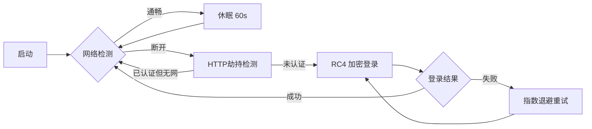

<h1 align='center'>Campus Network Auto-Login Daemon</h1>

[](https://www.python.org/downloads/)
[](https://opensource.org/licenses/MIT)
[](https://www.microsoft.com/windows)

本项目提供一个轻量级、低资源占用的校园网自动重连守护进程。专为解决凌晨 02:00 强制断网及网络不稳定场景设计，支持 RC4 加密认证与双重网络检测机制。

---

## ✨ 核心特性

*   **智能保活**：基于 DNS (UDP) 与 HTTP (TCP) 的双重检测机制，准确判断网络状态。
*   **算法还原**：完整复现官方网关的 RC4 密码加密逻辑（KSA/PRGA），无需依赖浏览器自动化。
*   **指数退避**：网络故障时自动启用指数退避算法（Exponential Backoff），避免高频请求造成的网关封锁。
*   **无感运行**：专为 `pythonw.exe` 后台运行设计，极低内存占用 (<15MB)。

## 🛠️ 工作流程



## 🚀 快速开始

### 1. 安装

```bash
git clone https://github.com/your-lab/campus-network-keepalive.git
cd campus-network-keepalive
pip install -r requirements.txt
```

### 2. 配置

复制配置文件并修改个人信息：

```bash
cp config.json.example config.json
```

**`config.json` 关键参数：**

> 注：此处给出示例，并不是全部参数。

```json
{
  "username": "YourID",           // 账号
  "password": "YourPassword",       // 密码
  "login_url": "http://1.1.1.3/ac_portal/login.php", // 登录接口
  "check_interval": 60,             // 检测周期(s)
  "dns_servers": ["223.5.5.5", "114.114.114.114"]
}
```

### 3. 运行

```bash
# 前台测试运行
python campus_net_keepalive.py
```

**预期输出**：

```
2024-12-30 09:00:00 - INFO - Configuration loaded successfully
2024-12-30 09:00:00 - INFO - ============================================================
2024-12-30 09:00:00 - INFO - Campus Network Auto-Login Daemon Started
2024-12-30 09:00:00 - INFO - Username: 20210001
2024-12-30 09:00:00 - INFO - Check interval: 60s
2024-12-30 09:00:00 - INFO - ============================================================
```

> 注：按 `Ctrl+C` 可停止程序。如果看到 `✓ Login successful`，说明配置正确。

---

## ⚙️ 部署指南 (Windows Service)

推荐使用 **Windows 任务计划程序** 实现开机自启与守护。

<details>
<summary><strong>点击展开详细配置步骤</strong></summary>


1. **创建任务**：按 `Win + R` 打开运行对话框，输入 `taskschd.msc`，点击 "创建基本任务"，命名为 `CampusAutoLogin`。
2. **触发器**：选择 **"计算机启动时"** (At Startup)。
3. **操作**：
   * **程序/脚本**：填写 `pythonw.exe` 的绝对路径 (例: `E:\Anaconda3\python.exe`)。
   * **添加参数**：填写脚本绝对路径 (例: `E:\Code\yznu-net-login\campus_net_keepalive.py`)。
   * **起始于**：**[必须]** 填写脚本所在文件夹路径 (例: `E:\Code\yznu-net-login\`)。
4. **安全选项** (重要)：
   * [x] 不管用户是否登录都要运行
   * [x] 使用最高权限运行
5. 条件页
   * [ ] 取消勾选 "只有在计算机使用交流电源时才启动"

6. 设置页
   * [x] 如果此任务已经运行：请勿启动新实例

</details>

---

## 🔧 常见问题 (FAQ)

1. **Q: 提示"Configuration file not found"**

​	A: 问题出在未创建 `config.json`，请执行`copy config.json.example config.json`，然后编辑 `config.json` 填写账号密码。

2. **Q: 提示"Placeholder values in configuration"**

​	A: 问题出在`config.json` 中仍使用模板占位符，请检查`"username"`和`"password"`字段是否已修改为真实值。

3. **Q: 登录失败，一直提示 Retrying？**

​	A: 校园网网关地址可能变更。请在浏览器按 `F12` 抓包手动登录过程，更新 `config.json` 中的 `login_url`。

4. **Q: 需要一直开着电脑吗？**

​	A: 是的。本程序运行在您的 PC 上。如果需要 24 小时在线，建议部署在树莓派或闲置工控机上。

____

⭐ 如果这个项目对您有帮助，请给个 Star！